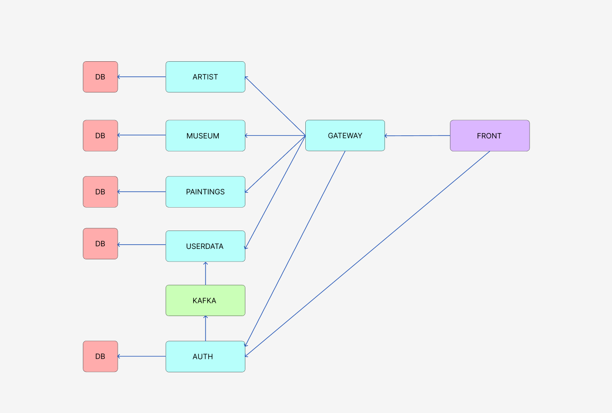

# Rococo

Rococo - выпускной проект для студентов 3 потока курса qa-guru java advanced. Представлен в виде сайта для хранения информации о художниках, музеях и картинах.

## **Технологии, использованные в Rococo**

- [Spring Authorization Server](https://spring.io/projects/spring-authorization-server)
- [Spring OAuth 2.0 Resource Server](https://docs.spring.io/spring-security/reference/servlet/oauth2/resource-server/index.html)
- [Spring data JPA](https://spring.io/projects/spring-data-jpa)
- [Spring Web](https://docs.spring.io/spring-framework/docs/current/reference/html/web.html#spring-web)
- [Spring actuator](https://docs.spring.io/spring-boot/docs/current/reference/html/actuator.html)
- [Spring web-services](https://docs.spring.io/spring-ws/docs/current/reference/html/)
- [Apache Kafka](https://developer.confluent.io/quickstart/kafka-docker/)
- [Postgres](https://www.postgresql.org/about/)
- [Thymeleaf](https://www.thymeleaf.org/)
- [JUnit 5 (Extensions, Resolvers, etc)](https://junit.org/junit5/docs/current/user-guide/)
- [Retrofit 2](https://square.github.io/retrofit/)
- [Allure](https://docs.qameta.io/allure/)
- [Selenide](https://selenide.org/)
- [Selenoid & Selenoid-UI](https://aerokube.com/selenoid/latest/)
- [Allure-docker-service](https://github.com/fescobar/allure-docker-service)
- [Java 17](https://www.oracle.com/java/technologies/javase/jdk17-archive-downloads.html)
- [Gradle 8.0](https://docs.gradle.org/8.0/release-notes.html)
- And much more:)

# Архитектура приложения

Приложение Rangiffler построено на основе микросервисной архитектуры, среди звеньев которой можно выделить:
1. **auth** - аутентификация и авторизация (*backend*).
2. **gateway** - связывание (прокси) клиента с необходимыми микросервисами (*backend*).
3. **userdata** - информация о пользователе: как личные данные, так и список друзей (*backend*).
4. **museum** - данные о музеях (*backend*).
5. **artist** - сведения об артистах (*backend*).
6. **painting** - сведения о картинах (*backend*).
7. **client** - интерфейс приложения, с которым взаимодействует пользователь (*frontend*).



**Минимальные предусловия для работы с проектом Rococo**


#### 1. Установить docker (Если не установлен)

После установки и запуска docker daemon необходимо убедиться в работе команд docker, например `docker -v`:

```posh
Docker version 24.0.5, build ced0996
```

#### 2. Спуллить контейнер postgres:15.1, zookeeper и kafka версии 7.3.2

```posh
docker pull postgres:15.1
docker pull confluentinc/cp-zookeeper:7.3.2
docker pull confluentinc/cp-kafka:7.3.2
```

После `pull` вы увидите спуленный image командой `docker images`

```posh
REPOSITORY                 TAG              IMAGE ID       CREATED         SIZE
postgres                   15.1             9f3ec01f884d   10 days ago     379MB
confluentinc/cp-kafka      7.3.2            db97697f6e28   12 months ago   457MB
confluentinc/cp-zookeeper  7.3.2            6fe5551964f5   7 years ago     451MB

```

#### 3. Создать volume для сохранения данных из БД в docker на вашем компьютере

```posh
docker volume create rococo
```

#### 4. Запустить БД, zookeeper и kafka 4-мя последовательными командами:

Для *nix:
```posh
docker run --name rococo-all -p 5432:5432 -e POSTGRES_PASSWORD=secret -v rococo:/var/lib/postgresql/data -d postgres:15.1

docker run --name=zookeeper -e ZOOKEEPER_CLIENT_PORT=2181 -e ZOOKEEPER_TICK_TIME=2000 -p 2181:2181 -d confluentinc/cp-zookeeper:7.3.2

docker run --name=kafka -e KAFKA_BROKER_ID=1 \
-e KAFKA_ZOOKEEPER_CONNECT=$(docker inspect zookeeper --format='{{ .NetworkSettings.IPAddress }}'):2181 \
-e KAFKA_ADVERTISED_LISTENERS=PLAINTEXT://localhost:9092 \
-e KAFKA_OFFSETS_TOPIC_REPLICATION_FACTOR=1 \
-e KAFKA_TRANSACTION_STATE_LOG_MIN_ISR=1 \
-e KAFKA_TRANSACTION_STATE_LOG_REPLICATION_FACTOR=1 \
-p 9092:9092 -d confluentinc/cp-kafka:7.3.2
```
Для Windows:
```posh
docker run --name rococo-all -p 5432:5432 -e POSTGRES_PASSWORD=secret -v rococo:/var/lib/postgresql/data -d postgres:15.1

docker run --name=zookeeper -e ZOOKEEPER_CLIENT_PORT=2181 -e ZOOKEEPER_TICK_TIME=2000 -p 2181:2181 -d confluentinc/cp-zookeeper:7.3.2

docker run --name=kafka -e KAFKA_BROKER_ID=1 -e KAFKA_ZOOKEEPER_CONNECT=$(docker inspect zookeeper --format='{{ .NetworkSettings.IPAddress }}'):2181 -e KAFKA_ADVERTISED_LISTENERS=PLAINTEXT://localhost:9092 -e KAFKA_OFFSETS_TOPIC_REPLICATION_FACTOR=1 -e KAFKA_TRANSACTION_STATE_LOG_MIN_ISR=1 -e KAFKA_TRANSACTION_STATE_LOG_REPLICATION_FACTOR=1 -p 9092:9092 -d confluentinc/cp-kafka:7.3.2
```

https://github.com/confluentinc/cp-docker-images/issues/801#issuecomment-692085103

#### 5. Установить одну из программ для визуальной работы с Postgres

Например, DBeaver, Datagrip или PgAdmin 4.

#### 6. Подключиться к БД postgres (host: localhost, port: 5432, user: postgres, pass: secret, database name: postgres) из PgAdmin и создать пустые БД микросервисов

```sql
create
    database "rococo-userdata" with owner postgres;
create
    database "rococo-artist" with owner postgres;
create
    database "rococo-museum" with owner postgres;
create
    database "rococo-painting" with owner postgres;
create
    database "rococo-auth" with owner postgres;
```

#### 7. Установить Java версии 17 или новее. Это необходимо, т.к. проект не поддерживает версии <17

Версию установленной Java необходимо проверить командой `java -version`

```posh
java version "17.0.8" 2023-07-18 LTS
Java(TM) SE Runtime Environment (build 17.0.8+9-LTS-211)
Java HotSpot(TM) 64-Bit Server VM (build 17.0.8+9-LTS-211, mixed mode, sharing)
```

Если у вас несколько версий Java одновременно - то хотя бы одна из них должна быть 17+
Если java не установлена вовсе, то рекомендую установить OpenJDK (например, из https://adoptium.net/en-GB/)

#### 8. Установить пакетый менеджер для сборки front-end npm

[Инструкция](https://docs.npmjs.com/downloading-and-installing-node-js-and-npm).
Рекомендованная версия Node.js - 18.13.0 (LTS)

# Запуск Rococo локально в IDE:

#### 1. Перейти в папку rococo-client

```posh
cd rococo-client
```

#### 2. Запустить фронтенд (сначала обновить зависимости)

```posh
npm i
npm run dev
```

#### 3. Прописать run конфигурацию для всех сервисов rococo-* - Active profiles local

Для этого зайти в меню Run -> Edit Configurations -> выбрать main класс -> указать Active profiles: local
[Инструкция](https://stackoverflow.com/questions/39738901/how-do-i-activate-a-spring-boot-profile-when-running-from-intellij).

#### 4 Запустить сервис rococo-auth командой Run в IDE:

Или просто перейдя к main-классу приложения RococoAuthApplication выбрать run в IDEA (предварительно удостовериться что
выполнен предыдущий пункт)

#### 5  Запустить в любой последовательности другие сервисы: rococo-artist, rococo-museum, rococo-painting, rococo-gateway, rococo-userdata